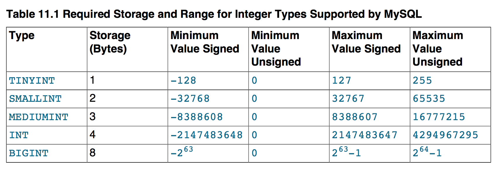
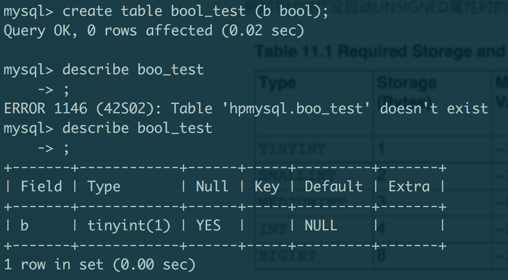
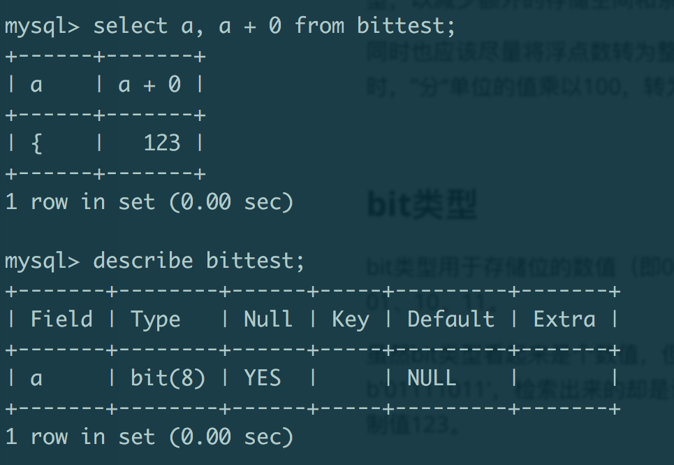

# 选择数据类型的几个简单原则

一般在设计数据库scheme之前，都要遵守选择数据类型的几个简单原则：

* 更小的通常更好——更少的磁盘、内存和CPU缓存；

* 简单就好——更简单的数据类型需要更少的CPU周期，系统开销和处理速度快。例如使用整型的代价比字符串和浮点数都要低，字符串的字符集和校验规则会使字符串之间的比较更复杂；

* 尽量避免使用NULL——通常情况下最好指定列为NOT NULL，除非要存储NULL值。可为NULL的列使得索引、索引统计和值比较都更复杂：

  * 占用更多的存储空间，在处理时需要特殊处理
  * 作为索引列时，每个索引记录都需要一个额外的字节

  虽然将可为NULL的列改为NOT NULL带来的性能提升比较小，但在设计数据库的时候也要尽量避免，可以给索引列减少存储空间和处理复杂度。

# 基本数据类型

## 数字类型（Numeric Type)

### 整数类型

根据存储空间的位数，可以表示不同范围的整数。假如存储位数是N，存储范围是-2(N-1)~2(N-1)-1。

整数类型有一个可选的UNSIGNED属性，表示不允许负数值。如果启用该属性，会将能表示的最大值增大一倍。例如TINYINT没启动UNSIGNED属性时的范围是-127~128，启动后值范围是0~255。

每个整数类型在定义的时候还可以指定宽度，例如INT(11)。但这个宽度与存储位数没有任何关系，仅仅表示在展示时，显示字符的个数。另外一个特殊的“整数类型“是BOOLEAN。在定义数据类型时，可以声明BOOLEAN类型，但在实际存储时是TINYINT(1)。

### 实数类型

DECIMAL类型用于表示精确的十进制实数，由MySQL服务器本身实现其高精度的计算。

声明DECIMAL类型时，可以指定十进制实数能表示总共的位数（precision)和小数点后几位(scale)。例如DECIMAL(5,2)表示总共5位存储实数，精确到小数点后2位，值范围是-999.99~999.99，小数点前后总共是5位，小数点后是2位。默认存储位数是10。当scale是0的时候，表示该实数没有小数部分。

FLOAT和DOUBLE类型用于表示近似的浮点运算。与DECIMAL类型的声明类似，FLOAT和DOUBLE也可以指定precision和scale，其意义相同。例如FLOAT(7, 4)能表示的值范围是-999.9999~999.9999。

DECIMAL类型存储空间会占用得更多，例如DECIMAL（18，9），小数点前9个数字将占用4个字节，小数点后9个数字占用4个字节，小数点本身一个字节，总共需要9个字节。

FLOAT占用4个字节，DOUBLE占用8个字节。如果不是要对小数进行非常精确的运算，应该尽量少用DECIMAL类型，以减少额外的存储空间和系统开销。

同时也应该尽量将浮点数转为整数，以避免不精确的浮点运算和额外的系统计算开销。例如存储财务数据时，”分“单位的值乘以100，转为”元“单位。

### bit类型

bit类型用于存储位的数值（即0和1组成的数字），声明时可指定位的数量，如bit(2)存储两位的数值——00、01、10、11。

虽然bit类型看起来是个数值，但MySQL把bit类型当做字符串类型，而不是数字类型，如存储一个值b'01111011'，检索出来的却是该值转为十进制值后在ASCII表中对应的字符'{'。但在数字上下文中存储却是其十进制值123。

由于其值比较诡异和难以理解，一般不会使用bit类型来存储位数据。

## 字符串类型