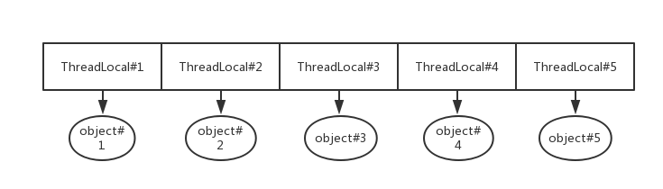
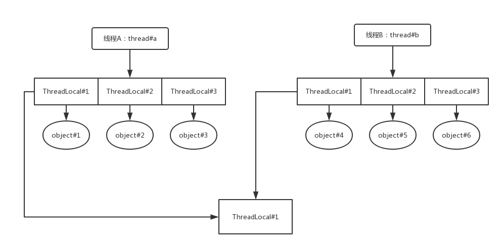
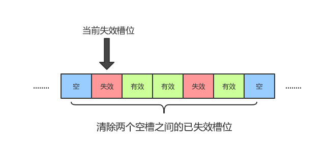
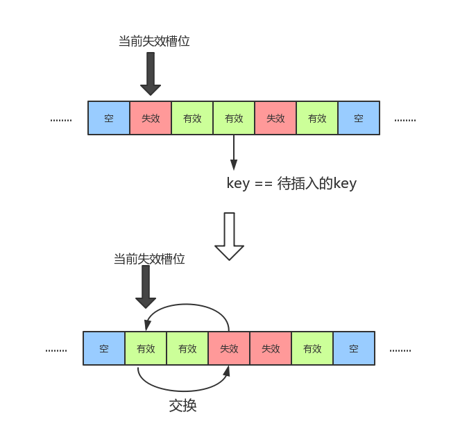
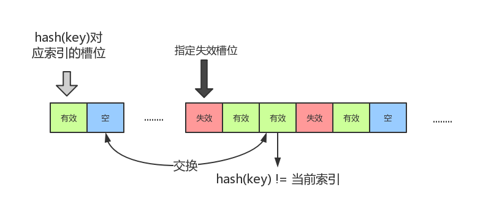
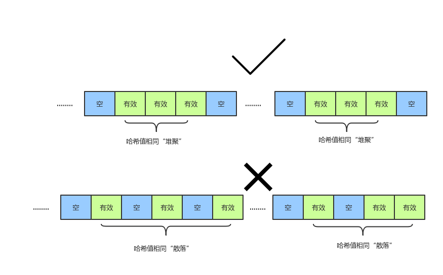
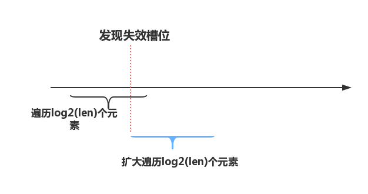

# 背景

最近一个产品需求是要记录下系统中的某些关键操作，以供用户通过接口能查看到系统的操作记录。为了达到该目的，我们肯定需要增加记录操作相关的代码，将操作记录落库。

但是假如直接在每个关键操作的代码前后都加上雷同的记录代码，会让代码更臃肿、更难理解，可维护性也更差。

<!-- more -->

```java
public void keyOperation() {
    int logId = insertLog();
  	...
    updateLog(logId, ...);
}
```

目前的优化方案是使用Spring AOP，在关键操作前后织入切面，在切面中开发操作记录相关的事情。

但是这样还是有问题，有些变量我们需要传递到切面中，例如操作者是谁、操作者的角色、操作的物品之类，这些信息都在目标对象代码中，无法直接通过反射获取。为此，我们引入了ThreadLocal，能解决切面和目标对象之间变量传递问题。

```java
public class ThreadLocalContext {
    private static final ThreadLocal<String> TL = new ThreadLocal<String>();
  	
  	public void set(String str) {
        TL.set(str);
    }
  
  	public String get() {
    	return TL.get();   
    }
}
```

```java
public class A {
    public void keyOperation() {
        ThreadLocalContext.set("operator");
      	...
    }
}
```

```java
public class Aspect {
    public void aroundService(ProceedingJoinPoint joinPoint) {
      	...
        Object ret = joinPoint.proceed();
        String operator = ThreadLocalContext.get();
      	...
    }
}
```

AOP+ThreadLocal的方法的确能够优化代码。但是在上线前，被其他同事测出了问题：ThreadLocal中的值很莫名其妙，与当前的操作信息对不上。例如在切面中通过ThreadLocal取出来的a变量明明没有在目标对象中被设置过值，却可以取出值，而且该值是其他操作中的信息。进一步排查，才发现原来自己的代码没有在使用后调用ThreadLocal的remove方法。由于我们的系统是跑在jetty上，每个线程在线程池中可能会被复用。线程1在上次对接口的调用中，设置了ThreadLocal的a变量，但由于没有remove，线程1在本次调用中就会还留着上次调用中a变量的值，从而导致bug。幸好在上线前发现了问题，否则后果不堪设想。

犯了该错误的主要原因是自己对ThreadLocal和系统的底层原理（如jetty、线程池等）还不够了解。为了避免重蹈覆辙，必须尝试弄清楚自己所使用到的技术，降低风险，尽可能减少bug的出现。


# ThreadLocal基本原理

ThreadLocal对象代表的是在不同线程中有不同值的一个变量，即该变量在线程A中的值是a，在线程B中的值是b。

ThreadLocal例子：

```java
public class ThreadLocalDemo {
    private static ThreadLocal<Integer> threadLocal = new ThreadLocal<>();

    private static void print() {
        System.out.println(threadLocal.get());
    }
    
    public static void main(String[] args) {
        for (int i = 0 ; i < 10; i++) {
            final int val = i;
            new Thread(() -> {
                try {
                    Thread.sleep(1000);
                } catch (InterruptedException e) {
                    e.printStackTrace();
                }
                threadLocal.set(val);
                print();
            }).start();
        }
    }
}
```

输出

```
2
3
9
0
5
7
8
1
4
6
```

由于每个线程都有自己的副本，所以不会冲突，能够输出各自线程的变量。

但假如不使用ThreadLocal，由于数据是共享的，不同线程在竞争的时候就会发生混乱，导致最后输出不会是各自不同。

```java
public class ThreadNotLocalDemo {
    private static int value;

    private static void print() {
        System.out.println(value);
    }

    public static void main(String[] args) {
        for (int i = 0 ; i < 10; i++) {
            final int val = i;
            new Thread(() -> {
                try {
                    Thread.sleep(1000);
                } catch (InterruptedException e) {
                    e.printStackTrace();
                }
                value = val;
                print();
            }).start();
        }
    }
}
```

输出：

```
9
9
9
9
9
9
9
9
9
9
```

也正是因为每个线程都有自己的副本，在项目中才能用来在切面和目标对象中传递变量，否则数据将会乱套。由于ThreadLocal对象一般在不同对象或方法间传递变量，因此ThreadLocal对象通常是静态类型。

通过一个ThreadLocal对象在不同线程存进去的不同对象是如何做到只能被自己线程访问？


首先，查看ThreadLocal类的源码得知，其实现完全依赖于其内部静态类ThreadLocalMap，代表映射ThreadLocal对象和线程本地变量的哈希表（该类没有父类，没有间接或直接实现java.util.Map接口）：


而之所以能做到这些线程本地的变量只能被自己线程访问，是因为ThreadLocalMap对象绑定在属于该线程的Thread类对象中（Thread类有一个域是ThreadLocalMap对象）。

```java
public class Thread implements Runnable {
  ...
  ThreadLocal.ThreadLocalMap threadLocals = null;
  ...
}
```

调用ThreadLocal类get方法取线程本地变量的时候，实际上就是从属于当前线程Thread类对象的threadLocal域中取的。

```java
public T get() {
  Thread t = Thread.currentThread();
  ThreadLocalMap map = getMap(t);
  if (map != null) {
    ThreadLocalMap.Entry e = map.getEntry(this);
    if (e != null) {
      @SuppressWarnings("unchecked")
      T result = (T)e.value;
      return result;
    }
  }
  return setInitialValue();
}

ThreadLocalMap getMap(Thread t) {
  return t.threadLocals;
}
```

换句话说就是每个线程都有只属于自己的ThreadLocalMap对象，而ThreadLocalMap对象有着ThreadLocal对象与对应线程本地变量的映射关系。

所以ThreadLocal对象获取线程本地变量(ThreadLocal.get方法）的大致过程是：

ThreadLocal.get() —> Thread.currentThread —> Thread.threadLocal域 —> ThreadLocalMap.get()

ThreadLocal对象存储线程本地变量(ThreadLocal.set方法）的过程仅最后一步不同，换为ThreadLocalMap.set：

ThreadLocal.get() —> Thread.currentThread —> Thread.threadLocal域 —> ThreadLocalMap.set()



如此一来，就能做到通过ThreadLocal对象存取的对象都只在该线程有效。


# 从ThreadLocalMap看哈希表实现

ThreadLocal类最核心的地方在于ThreadLocalMap的实现，接下来看ThreadLocalMap的内部原理。

ThreadLocalMap中key是ThreadLocal对象，value是Object对象（因为可以是任意的对象），底层是一个Entry类型的数组table。

```java
private Entry[] table;

static class Entry extends WeakReference<ThreadLocal<?>> {
  /** The value associated with this ThreadLocal. */
  Object value;

  Entry(ThreadLocal<?> k, Object v) {
    super(k);
    value = v;
  }
}
```

与HashMap类相似，table数组要求容量必须是2的幂次方，也有起着平衡因子作用的阈值threshold。当table数组的长度（即非空槽的个数）大于阈值，就要扩容——新建一个容量是当前2倍的数组，将原来数组中的值重新调整到新数组中。


## 避免内存泄漏

我们会发现Entry类并不简单，它继承了WeakReference类。为什么要多此一举？

```java
static class Entry extends WeakReference<ThreadLocal<?>> {
  /** The value associated with this ThreadLocal. */
  Object value;

  Entry(ThreadLocal<?> k, Object v) {
    super(k);
    value = v;
  }
}
```

这是因为要避免内存泄漏。假如Entry类不继承WeakReference类，尽管ThreadLocal对象被用户使用过一次之后，就再也没有被使用，也不会被当做垃圾回收，这是因为ThreadLocal对象一直被ThreadLocalMap的table数组引用，从而导致一直在内存中。

每个WeakReference类对象都必须设置代表弱引用的对象referent。当GC的时候发现这个referent对象只有被WeakReference类对象引用的时候，等同于该referent对象是弱可达，垃圾回收器将标记为可回收的。对于Entry类来说，就是当ThreadLocal对象只有被Entry类对象引用的时候，由于Entry类对象是WeakReference类对象，所以ThreadLocal对象会被当做是弱引用，会在将来某个时刻被回收。当ThreadLocal对象被回收之后，调用Entry对象的get()方法只会得到null。


## ThreadLocalMap.set

我们首先看如何插入值到ThreadLocalMap中。

```java
private void set(ThreadLocal<?> key, Object value) {
  Entry[] tab = table;
  int len = tab.length;
  int i = key.threadLocalHashCode & (len-1);
  ...
}
```

最开始是要计算出key的哈希值，也就是threadLocal对象的哈希值。threadLocal对象的哈希值并不是取hashcode方法，而是取决于ThreadLocal类对象的域threadLocalHashCode。

```java
private final int threadLocalHashCode = nextHashCode();

private static int nextHashCode() {
  return nextHashCode.getAndAdd(HASH_INCREMENT);
}

private static AtomicInteger nextHashCode = new AtomicInteger();

private static final int HASH_INCREMENT = 0x61c88647;
```

从源码分析，threadLocalHashCode值就是0x61c88647的N倍值，取决于是第几个创建。

我们知道数组的容量len肯定是2的幂次方数字，所以(len - 1)用2进制表示的时候是n个1：`1111111....111`。`threadLocalHashCode & (len - 1)`也就是取threadLocalHashCode对应2进制值的低n位。

很神奇的是，利用0x61c88647不同倍数值的低n位产生的哈希值分布地非常均匀，有 [网友实验为证](https://blog.csdn.net/houbin0912/article/details/77968844)。这与0x61c88647本身这个数有关，0x61c88647等于(sqrt(5) - 1) * 2<sup>31</sup>，是一个满足黄金比例的数。使用该魔数，能大大降低哈希冲突的可能。


但这仍然无法完全避免哈希冲突，此时ThreadLocalMap采用的方式是开放地址方法——出现冲突的时候，往其他空槽内插入。但由于在设计的时候考虑了内存泄漏的问题，非空槽不一定就是有效的槽位，也有可能槽位的key，即ThreadLocal对象已经被回收了，因此还要判断槽位是不是已经失效。

```java
Entry[] tab = table;
int len = tab.length;
int i = key.threadLocalHashCode & (len-1);

for (Entry e = tab[i];
     e != null;
     e = tab[i = nextIndex(i, len)]) {
  ThreadLocal<?> k = e.get();

  if (k == key) {
    e.value = value;
    return;
  }

  if (k == null) { // 槽位已经失效
    replaceStaleEntry(key, value, i);
    return;
  }
}

tab[i] = new Entry(key, value);
int sz = ++size;
if (!cleanSomeSlots(i, sz) && sz >= threshold)
  rehash();
```

ThreadLocalMap的set方法大概做了以下几件事情：

* 从哈希值的索引出发遍历，直到空槽为止，然后创建新的entry，插入到数组中
* 假如遍历过程中发现槽位的key等同于待插入的key，直接将槽位的value替代为待插入的value即可
* 假如遍历过程中发现槽位已经失效，执行`replaceStaleEntry`方法，执行完毕后结束整个过程
* 创建新entry后，假如当前数组的长度已经超过阈值，则调整table数组扩容

关键在于遍历发现槽位已经失效时，执行的`replaceStaleEntry`方法。


### replaceStaleEntry方法

`replaceStaleEntry`方法并不是简单地将新的key-value放到槽位中即可，还要考虑哈希表中可能有其他槽位的key等于待插入的key，否则可能存在两个key相同但value不同的槽位的情况。

除了要找出哈希表中有没有key相同的槽位，该方法还做了另外一件额外的事情——消除该失效槽位所处于两个空槽序列中的所有失效槽位。这一开始会有点难理解。在JDK的说明中，两个空槽之间的槽位序列称为一个"run"，换句话说就是要消除该失效槽位所在"run"中的所有失效槽位，如下图所示：



消除失效槽位即将该槽位的key和value都置为null，也就是变为空槽。清除完毕"run"中所有的失效槽位之后，就在当前失效槽位中放入新的key-value。

上文还提及到，在替代失效槽位的时候，还要考虑失效槽位后面可能还有着等同于待插入key的有效槽位情况。所以在遍历两个空槽之间的槽位时，假如发现有效槽位m的key等于准备放入的key，要交换当前失效槽位和该有效槽位m的位置，把该有效槽位m变为失效。



```java
private void replaceStaleEntry(ThreadLocal<?> key, Object value,
                                       int staleSlot) {
  Entry[] tab = table;
  int len = tab.length;
  Entry e;

  // Back up to check for prior stale entry in current run.
  // We clean out whole runs at a time to avoid continual
  // incremental rehashing due to garbage collector freeing
  // up refs in bunches (i.e., whenever the collector runs).
  int slotToExpunge = staleSlot;
  for (int i = prevIndex(staleSlot, len);
       (e = tab[i]) != null;
       i = prevIndex(i, len))
    if (e.get() == null)
      slotToExpunge = i;

  // Find either the key or trailing null slot of run, whichever
  // occurs first
  for (int i = nextIndex(staleSlot, len);
       (e = tab[i]) != null;
       i = nextIndex(i, len)) {
    ThreadLocal<?> k = e.get();

    // If we find key, then we need to swap it
    // with the stale entry to maintain hash table order.
    // The newly stale slot, or any other stale slot
    // encountered above it, can then be sent to expungeStaleEntry
    // to remove or rehash all of the other entries in run.
    if (k == key) {
      e.value = value;

      tab[i] = tab[staleSlot];
      tab[staleSlot] = e;

      // Start expunge at preceding stale entry if it exists
      if (slotToExpunge == staleSlot)
        slotToExpunge = i;
      cleanSomeSlots(expungeStaleEntry(slotToExpunge), len);
      return;
    }

    // If we didn't find stale entry on backward scan, the
    // first stale entry seen while scanning for key is the
    // first still present in the run.
    if (k == null && slotToExpunge == staleSlot)
      slotToExpunge = i;
  }

  // If key not found, put new entry in stale slot
  tab[staleSlot].value = null;
  tab[staleSlot] = new Entry(key, value);

  // If there are any other stale entries in run, expunge them
  if (slotToExpunge != staleSlot)
    cleanSomeSlots(expungeStaleEntry(slotToExpunge), len);
}
```

到这里，已经有了一些疑问：

* 为什么在替代失效槽位的时候要清除所在"run"中的所有失效槽位？
* 判断有无槽位中的key等于待插入key时，为什么不用遍历整个数组，只需要遍历到空槽？
* 当发现等于待插入key的有效槽位时，为什么要交换当前的失效槽位和等于待插入key的有效槽位？

要解答这些问题，必须要结合清除失效槽位的方法`expungeStaleEntry`来看。


### expungeStaleEntry方法

`expungeStaleEntry`方法并不是清除一个特定的失效槽位，而是清除从指定失效槽位之后到下一个空槽之间的所有失效槽位（因此在`replaceStaleEntry`方法中，需要向前遍历找到空槽后的第一个失效槽位，将其索引传给`expungeStaleEntry`方法，就能清除两个空槽之间的所有失效槽位）。不仅如此，还会调整其中发现的有效槽位在table数组中的位置——假如该有效槽位的key计算出来的哈希值并不等于所在数组的索引，则将该槽位挪到哈希值对应索引后的第一个空槽。



```java
private int expungeStaleEntry(int staleSlot) {
  Entry[] tab = table;
  int len = tab.length;

  // expunge entry at staleSlot
  tab[staleSlot].value = null;
  tab[staleSlot] = null;
  size--;

  // Rehash until we encounter null
  Entry e;
  int i;
  for (i = nextIndex(staleSlot, len);
       (e = tab[i]) != null;
       i = nextIndex(i, len)) {
    ThreadLocal<?> k = e.get();
    if (k == null) {
      e.value = null;
      tab[i] = null;
      size--;
    } else {
      int h = k.threadLocalHashCode & (len - 1);
      if (h != i) {
        tab[i] = null;

        // Unlike Knuth 6.4 Algorithm R, we must scan until
        // null because multiple entries could have been stale.
        while (tab[h] != null)
          h = nextIndex(h, len);
        tab[h] = e;
      }
    }
  }
  return i;
}
```

最后`expungeStaleEntry`方法返回的是下一个空槽的索引。


现在结合`replaceStaleEntry`方法和`expungeStaleEntry`方法，我们能清晰地看到整个操作过程：

1. 将当前失效槽位所在"run"中的所有其他失效槽位改为空槽。
2. 调整槽位key的哈希值不等于当前索引的槽位，与key哈希值对应索引的槽位后的第一个空槽交换。
3. 发现等于待插入key的有效槽位时，与当前失效槽位交换。

整个过程的目的就是尽量将哈希值相同的key对应的槽位都”堆聚”一起！避免哈希值相同的key对应槽位“散落”，被空槽分隔。



现在可以解答上文留下的疑问：

* 为什么在替代失效槽位的时候要清除所在"run"中的所有失效槽位？

  首先我们要了解不清除失效槽位会产生两个严重的问题：

  （1）table数组“虚胖”，空槽越来越少，扩容越来越频，浪费资源；

  （2）失效的槽位entry中引用的value不是弱引用，必须要定期清除整个table数组中的所有失效槽位，将Entry对象中的value释放出去，被垃圾收集器回收。

  但问题在于为什么在替代失效槽位的时候来清除？这是因为发现了失效槽位，说明也有可能其他槽位是已经失效的。为了减少失效槽位，清除所在"run"中的所有失效槽位，就能保证局部不会有失效槽位。下文还会提及到实际上清除完局部的失效槽位后，还会执行`cleanSomeSlot`方法“全局”地清除失效槽位。

  ​


* 查找哈希表中有无其他key等于待插入key时，为什么不用遍历整个哈希表，只需要遍历到第1个出现的空槽？

  由于`replaceStaleEntry`方法和`expungeStaleEntry`方法将哈希值相同的key槽位“堆聚”一起，哈希值相同的key槽位不会在第1个出现空槽之后。

  ​

* 当发现等于待插入key的有效槽位时，为什么要交换当前的失效槽位和等于待插入key的有效槽位？

  使得哈希值相同的key槽位尽量“堆聚”一起。假如不交换，哈希值相同的key槽位就会被消除后的空槽所分隔。


### cleanSomeSlot方法

在`replaceStaleEntry`方法和`set`方法中，我们还会注意到这两个方法的返回最后都会执行`cleanSomeSlot`方法。

```java
private boolean cleanSomeSlots(int i, int n) {
  boolean removed = false;
  Entry[] tab = table;
  int len = tab.length;
  do {
    i = nextIndex(i, len);
    Entry e = tab[i];
    if (e != null && e.get() == null) {
      n = len;
      removed = true;
      i = expungeStaleEntry(i);
    }
  } while ( (n >>>= 1) != 0);
  return removed;
}
```

该方法的目的就是在整个table数组中尽量多地清除失效槽位，但注意不是遍历整个数组。该方法会遍历log2(n)个元素（n >>> 1即逻辑右移，高位填充0，等同于除以2），假如发现已失效的槽位，就将执行`expungeStaleEntry`方法，清除到下一个空槽之间的失效槽位。同时直接跳到空槽，又继续遍历log2(len)次个元素（len为当前数组的容量），如此往复，直到没有发现失效槽位。



为什么要执行在`replaceStaleEntry`方法和`set`方法后要额外对table数组"全局"遍历清除更多的失效槽位？`replaceStaleEntry`方法也会将一个"run"中的所有失效槽位清除并调整。

假如仅依靠`replaceStaleEntry`方法，就会覆盖不了整个table数组，某些槽位可能插入之后再无插入。例如第i个槽位被插入后，table数组再也没有新插入key-value到第i个槽位附近，那么第i个槽位的value可能就会内存泄漏。

使用定期调度的方法来解决对于JDK源码而言并不优雅，因此每次对ThreadLocalMap对象操作之后，都希望必须清除尽量多的失效槽位。但考虑到假如每次`get`、`set`和`remove`方法之后都执行`cleanSomeSlot`方法，会对方法的执行造成比较大的时延。对比之后，JDK作者认为`set`的执行频率一般而言会比`get`和`remove`低，因此只有在执行`set`方法才会执行`cleanSomeSlot`方法。

另外值得一提的是，`cleanSomeSlot`方法并不是遍历整个table数组来清除失效槽位，它采用了"启发式"的算法——在没有遇到失效槽位的情况下，遍历log2(len)个数组元素；遇到失效槽位则增加遍历元素个数，直到没有遇到失效槽位为止。例如当前数组容量是32时，`cleanSomeSlot`方法最少会遍历5个元素，这种方式比起全局扫描肯定效果会差，但是基于经验得到的效果能被接受，不会太差。


## ThreadLocalMap.get

有了前面的铺垫，`get`方法的原理比`set`简单不少。首先要计算的是key的哈希值，假如table数组中对应索引的槽位中的key与待查询的key不相同，则往后遍历，直到发现与待查询的key相同或者空槽。到了空槽还没发现就说明key没有对应的value，返回null。

在往后遍历的时候假如发现了失效的槽位则执行`expungeStaleEntry`清除到下一个空槽之间的失效槽位。由于执行`expungeStaleEntry`方法时会调整槽位在table数组中的位置顺序，会将key相同的堆聚一起，所以可以继续往后遍历，直到遇到空槽。

```java
private Entry getEntry(ThreadLocal<?> key) {
  int i = key.threadLocalHashCode & (table.length - 1);
  Entry e = table[i];
  if (e != null && e.get() == key)
    return e;
  else
    return getEntryAfterMiss(key, i, e);
}

private Entry getEntryAfterMiss(ThreadLocal<?> key, int i, Entry e) {
  Entry[] tab = table;
  int len = tab.length;

  while (e != null) {
    ThreadLocal<?> k = e.get();
    if (k == key)
      return e;
    if (k == null)
      expungeStaleEntry(i);
    else
      i = nextIndex(i, len);
    e = tab[i];
  }
  return null;
}
```


## ThreadLocalMap.remove

`remove`方法和`get`类似，计算哈希值后，往后遍历找出key相同的槽位，找到之后将槽位的key改为null并执行`expungeStaleEntry`方法。

但不同的是，`remove`方法在遍历的过程中，会直接忽略失效的槽位，只关注目标key对应的槽位。假如遇到失效的槽位就执行`expungeStaleEntry`方法，就会可能使得本应该堆聚的槽位被空槽隔断。例如，第i槽位失效，第i+1、i+2是有效的槽位，此时如果执行`expungeStaleEntry`方法，会将i+1槽位挪到第i槽位，第I+2槽位挪到i+1。假如调整后的第i槽位中的key是我们要找的key，直接删除后就会造成i槽位变为空槽，i+2槽位是有效槽位，可能i+2槽位的key哈希值和i-1槽位的哈希值是相同的，于是key哈希值相同的key-value没有“堆聚”。

```java
private void remove(ThreadLocal<?> key) {
  Entry[] tab = table;
  int len = tab.length;
  int i = key.threadLocalHashCode & (len-1);
  for (Entry e = tab[i];
       e != null;
       e = tab[i = nextIndex(i, len)]) {
    if (e.get() == key) {
      e.clear();
      expungeStaleEntry(i);
      return;
    }
  }
}
```


# 总结

我们从源码出发之后，就能得知到只有ThreadLocalMap的`set`方法中才会尝试尽量多清除table数组中的失效槽位。`get`和`remove`只会清除一次到下一个空槽之间的失效槽位，清除失效的槽位很有限。所以当`set`方法被调用的频率是初期很高、后期很低时，假如在后期`get`也只常调用某些key，造成另外一些已经无用的key对应的value一直被entry引用却无法释放，将很可能导致内存泄漏。所以建议使用ThreadLocal完毕后调用`remove`方法，避免内存泄漏的情况。


另外插一个题外话：能不能使用HashMap来代替ThreadLocalMap？

答案是不可以——尽管HashMap的key可以封装一个继承WeakReference的类，但由于key可能已经失效，此时需要类似ThreadLocalMap的`cleanSomeSlot`方法来清除数组中的所有已失效槽位，这些都无法在HashMap的这一层封装来做，只能在底层的table数组内部实现。所以HashMap无法替代ThreadLocalMap。


假如我们不深入ThreadLocal的底层实现，是无法知道ThreadLocal可能会内存泄漏，要多加注意。

常言道：勿在浮沙筑高台。不深入理解我们使用的技术/框架/工具，终究会在某些环节带来厄运。由此看来，多探讨细节有百利而无一害，共勉之！