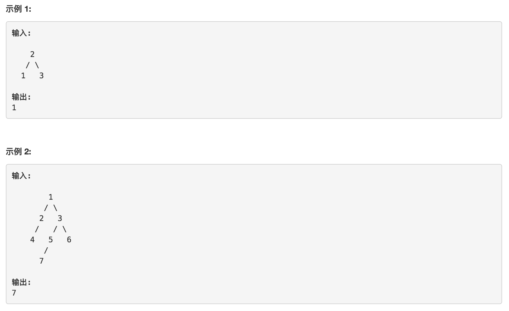

题目链接： https://leetcode-cn.com/problems/find-bottom-left-tree-value/description/

给定一个二叉树，在树的最后一行找到最左边的值。

<!--more-->



思路是层次遍历，但是最普通的层次遍历分辨不出当前的元素处于第几层，必须换一种方法来遍历。要找到最后一层最左边的值，必须将树的每一层变为一组数组或者链表，数组或链表的首元素即最左边的值。而假定当前的数组就是代表遍历过树的最后一层currentLevel[1...n]，遍历currentLevel[1...n]中的结点的左右子节点能找出下一层的结点。假如遍历完后没有任何的下一层结点存在，说明树到了最底层，currentLevel[1]即最左边的值；假如遍历完currentLevel下一层后还有结点存在，说明还没到最底层，此时curretnLevel要指向该下一层结点的数组。


代码如下：

```java
public int findBottomLeftValue(TreeNode root) {
  TreeNode[] currentLevel = {root};
  int currentLevelLength = 1;
  while (true) {
    TreeNode[] nextLevel = new TreeNode[2 * currentLevelLength];
    int nextLevelLength = 0;
    for (int i = 0; i < currentLevelLength; i++) {
      if (currentLevel[i].left != null) {
        nextLevel[nextLevelLength++] = currentLevel[i].left;
      }
      if (currentLevel[i].right != null) {
        nextLevel[nextLevelLength++] = currentLevel[i].right;
      }
    }

    if (nextLevelLength == 0) {
      return currentLevel[0].val;
    } else {
      currentLevel = nextLevel;
      currentLevelLength = nextLevelLength;
    }
  }
}
```

